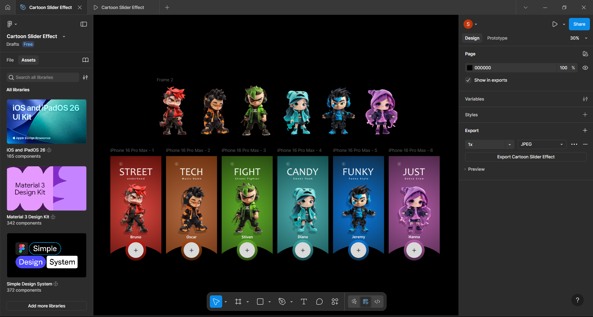

# Slider_Effect_Figma
## 🎨 Cartoon Character Slider Effect (Figma Prototype)

This project showcases a Cartoon Character Slider Effect created in Figma, featuring six unique character cards animated with a smooth slider transition

## 🧩 Project Overview

The Cartoon Slider Effect demonstrates how to create a character selection-style animation using Figma’s Prototype mode.
Each slide represents a different themed character with distinct colors and styles.

Character Slides:

🔴 Street — Bruno
🟠 Tech — Oscar
🟢 Fight — Stiven
🩵 Candy — Diana
🔵 Funky — Jeremy
🟣 Just — Hanna

## ⚙️ Animation Details

- Prototype Animation: Slider → Push
- Easing Type: Ease-In
- Duration: 1200 ms
- Frames: 6
- Effect: Smooth horizontal sliding between cards

The Push animation was used to create a seamless movement between character cards, simulating a slider or carousel effect commonly seen in UI designs.

Click below to interact with the design directly in Figma:
[View prototype]([https://www.figma.com/design/7rmZPmMgQqr5ZwfZtR2q3a/Untitled?node-id=0-1&t=RLKVOKeL9SFNjJMl-1](https://www.figma.com/design/eowxxpzT67X0VsK1e0UySX/Cartoon-Slider-Effect?node-id=0-1&t=UjYw7CrPB7DUKW0p-1))

